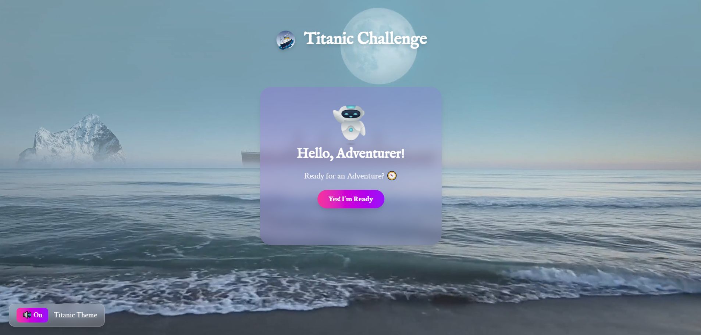

<h1 align="center">🛳 Will You Survive? – Titanic Survival Prediction</h1>

  Predict Titanic passenger survival with a modern, interactive full-stack app.  
  Real-time predictions, shareable cards, animations, and even the Titanic theme song! 🎶

  <!-- Frontend Badges -->
  
  
  
  
  
  
  
  
  
  

  <!-- Backend / ML Badges -->
  
  
  
  
  
  

---

## 🧾 Overview

Will You Survive? is a full-stack machine learning application that predicts the survival chances of Titanic passengers based on their details (age, gender, class, etc.). It combines a robust FastAPI backend with pre-trained scikit-learn models and a modern React frontend styled with TailwindCSS and DaisyUI.

The app provides real-time survival predictions, generates shareable prediction cards, and offers social sharing and download options. It features an animated UI with confetti, Lottie animations, and a sound on/off toggle for the iconic Titanic theme, offering an immersive and engaging user experience.✨ 

---

## 📸 Preview

  

---

## ✨ Key Features

### 🎯 Prediction
- Input passenger details (age, gender, class, etc.)
- Real-time survival prediction with probability scores
- Pre-trained scikit-learn model (Random Forest)
- Personalized **Prediction Cards** with survival results and probabilities

### 🔗 Sharing & Export
- Share prediction results via social media (Facebook, Twitter, WhatsApp, Instagram)
- Download prediction cards as PNG images

### 🎨 UI & UX
- Clean, responsive design with TailwindCSS & DaisyUI
- Smooth animations using **Framer Motion and Lottie**
- Interactive confetti effects and toast notifications
- Play/pause the Titanic theme song with a dedicated on/off button 🎵
- User-friendly interface for seamless interaction

### ⚙️ Backend
- **FastAPI and Uvicorn** for fast API responses
- Pydantic for request/response schema validation
- Joblib for model serialization and loading
- Preprocessing: missing value handling, encoding, scaling

---

## 🚀 Tech Stack

**Backend**  
- FastAPI, Uvicorn  
- scikit-learn, Joblib  
- Pydantic  

**Frontend**  
- React 19 (Vite)  
- TailwindCSS 4 + DaisyUI  
- React Router v7  
- Framer Motion, Lottie  
- React Hot Toast, React Confetti  
- html2canvas  

**Other**  
- LocalStorage for persistence  
- HTML5 Audio for Titanic theme integration  
- Web Share API for social sharing  

---

## 📈 Model Training
- **Dataset**: Titanic (Kaggle)  
- **Preprocessing**: Missing values → encoding  
- **Model**: Random Forest  
- **Serialization**: Best model saved with Joblib for FastAPI  

---

## 📜 License

[MIT License](./LICENSE) – Free to use, modify, and distribute.

---

## 👩‍💻 Author

Developed by [Jarin Tasnin Anika](https://github.com/tasninanika)
